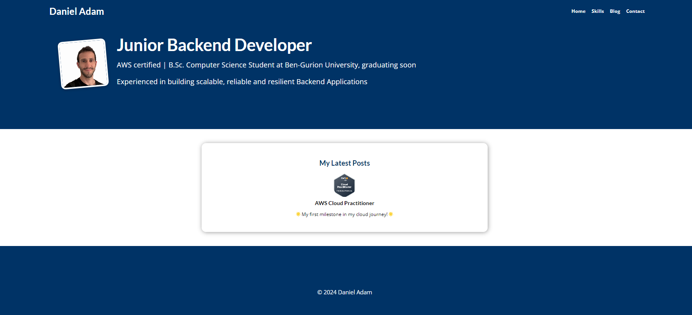

# Personal Website with Blog Section ([danieladam.click](https://danieladam.click/))

A personal website featuring a blog section, developed with Django and Python, including CRUD operations on posts, tags, and comments and a PostgreSQL database
and AWS deployment, infrastructure, and domain handling. 

## Tech Stack 💻

- **Django**: Backend framework used to build the website, handling all the logic and database interactions.
- **Python**: Programming language used for server-side logic.
- **AWS**: Hosting and storage services used for deployment, database, static and media files storage.
- **Git**: Version control system used to track changes and manage the project.

## Features 🏆
- **CRUD Operations**: Create, Read, Update, and Delete blog posts, tags, and comments.
- **Email Notifications**: Set up email notifications for new comments and approvals.
- **Google reCAPTCHA API Integration**: Integrated for user authentication and spam prevention.
- **Unit Testing**: Conducted with pytest to validate code functionality and reliability.

## Deployment 🌐
- **AWS Elastic Beanstalk**: Used for hosting and managing the application.
- **AWS Load Balance**: Used for setting up http/s listener
- **AWS S3**: Used for static and media file storage.
- **AWS RDS**: Configured for database management.
- **AWS Route 53**: Domain management.
- **AWS CAM**: SSL certification.
- **AWS CodePipeline**: Set up for CI/CD to integrate new features.

## Preview 🎞️

## Usage 🎯
- Visit [danieladam.click](https://danieladam.click/) to explore my website and blog.
- Use the navigation bar to browse through Home, Skills, Blog, and Contact sections.
- To leave comments on a blog post, sign up with your name and email, the comment will be sent to the admin for approval.

## Connect me 📫

